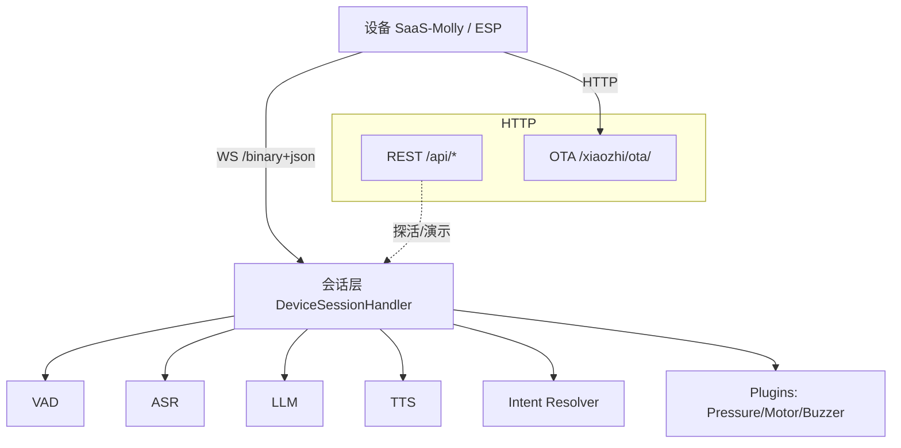
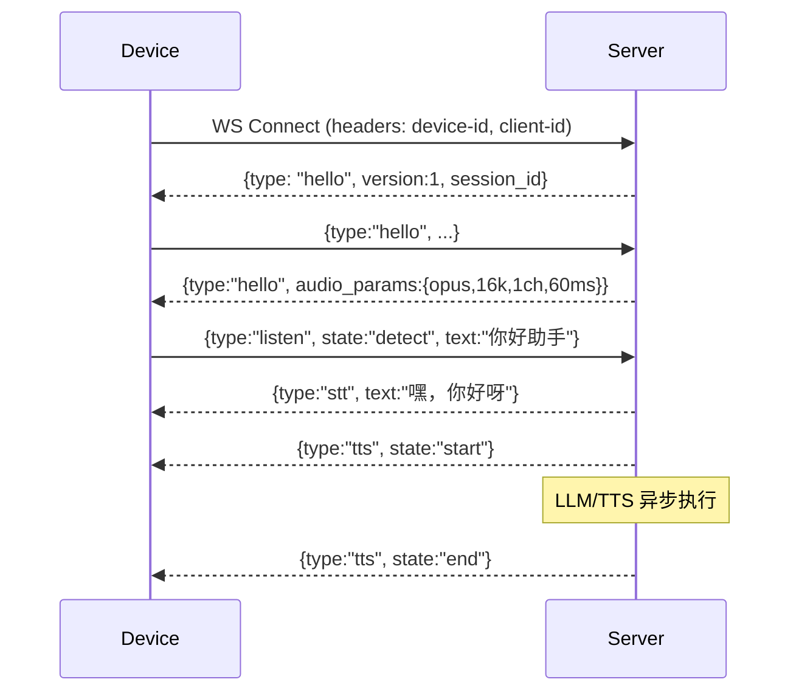

## SaaS-Molly 服务器端（Rebuild-XZ）

[](https://www.python.org/)
[](https://docs.aiohttp.org/)
[](https://docs.python.org/3/library/asyncio.html)
[](./)
[](./LICENSE)
[](./)

面向智能玩具设备（SaaS-Molly / ESP 系列）的语音与对话服务器。提供 WebSocket 低延迟会话、ASR/LLM/TTS 语音对话流水线、意图解析、记忆系统、IoT 事件注入与 OTA 地址发现接口，一体化支持设备端快速接入与升级。


## 目录

- **功能特性**
- **系统总览与架构图**
- **项目结构**
- **快速上手**
- **配置说明（TOML）**
- **运行与验证**
- **设备接入协议（WebSocket）**
- **REST API 列表**
- **OTA 接口**
- **模块与插件说明**
- **日志与调试**
- **测试与质量保障**
- **部署与安全建议**
- **常见问题（FAQ）**


## 功能特性

- **语音全链路**（VAD → ASR → LLM → TTS）：
  - ASR: FunASR 本地/服务端双模式；
  - LLM: 阿里qwen-turbo（OpenAI 兼容协议）；
  - TTS: EdgeTTS 与 GPT-SoVITS v2 可选；
- **实时会话管道**：设备文本/音频/IOT/传感器事件统一入口，后端异步并行推理与播放控制。
- **OTA 支持**：提供设备发现/升级所需地址信息（可与主服务分离端口）。
- **可扩展插件**：压力传感器/马达/蜂鸣器等硬件插件，支持回调与函数调用式意图解析。


## 系统总览与架构图



典型握手与对话时序：




## 项目结构

```text
rebuild-xz/
  adapters/            # VAD/ASR/LLM/TTS/WS/OTA 适配器
  api/                 # REST API 路由
  config/              # TOML 配置与注册
  orchestrator/        # 会话编排（DeviceSession、Gateway、OTA）
  plugins/             # 压力传感器/电机/蜂鸣器等插件
  models/              # 本地 VAD 模型和 ASR 模型
  dual_server.py       # 一体化启动（WS+API + OTA）
  run_ota.py           # 独立 OTA 服务启动
  ota_server.py        # 模块话的 OTA 实现
  requirements.txt     # 依赖清单
  ...
```


## 快速上手

### 环境要求

- Python 3.9+（建议 3.10/3.11）
- FFmpeg（用于 `pydub` 音频处理，Windows 需将 ffmpeg/bin 加入 PATH）

### 安装

```bash
# 可选：创建虚拟环境
python -m venv .venv
# Windows PowerShell: .\.venv\Scripts\Activate.ps1
# macOS/Linux: source .venv/bin/activate

# 安装依赖
pip install -r requirements.txt
```

### 最小配置检查

编辑 `config/settings.toml`：

```toml
[system]
service_port = 8000
ota_port = 8002

[modules]
voice_activity_detector = "SileroVAD"
speech_recognizer = "FunASR"
language_model = "AliLLM"
speech_synthesizer = "EdgeTTS"
memory_engine = "nomem"
intent_resolver = "function_call"

[asr.FunASR]
type = "fun_local"
model_dir = "models/SenseVoiceSmall"

[llm.AliLLM]
# 重要：替换为你的真实密钥
api_key = "sk-************************"
base_url = "https://dashscope.aliyuncs.com/compatible-mode/v1"
model_name = "qwen-turbo"
```


## 运行与验证

- 一体化启动（WS+API 与 OTA 同时运行）：

```bash
python dual_server.py
```

- 仅启动独立 OTA 服务：

```bash
python run_ota.py
```

- 验证监听：
  - 打开浏览器访问 `http://<host>:8000/api/device` → 应返回 `{"device":"ok"}`


## 配置说明（TOML）

| 区域 | 键 | 类型 | 默认值 | 说明 |
|---|---|---|---|---|
| system | service_port | int | 8000 | WS 与 REST API 监听端口 |
| system | ota_port | int | 8002 | OTA 服务端口 |
| modules | voice_activity_detector | str | SileroVAD | VAD 实现名 |
| modules | speech_recognizer | str | FunASR | ASR 实现名（支持本地/服务端） |
| modules | language_model | str | AliLLM | LLM 实现名（OpenAI 兼容） |
| modules | speech_synthesizer | str | EdgeTTS | TTS 实现名 |
| modules | intent_resolver | str | function_call | 意图解析实现 |
| asr.FunASR | type | str | fun_local | `fun_local` 或 `fun_server` |
| llm.AliLLM | api_key | str | - | 替换为你的密钥 |

更多字段详见 `config/settings.toml`。


## 设备接入协议（WebSocket）

- URL：`ws://<host>:<service_port>/xiaozhi/v1/`
- 握手要求：Header 或 Query 必须携带 `device-id` 与 `client-id`。
- 服务端握手：连接后立即下发 `{type:"hello", version:1, transport:"websocket", session_id}`。

### 文本消息（上行）

| type | 用途 | 关键字段 | 示例 |
|---|---|---|---|
| hello | 设备自报字段 | 任意附加字段 | `{ "type":"hello", "device":"SaaS-Molly" }` |
| listen | 控制拾音/检测 | `state:start，stop，detect`, `mode:auto，manual` | `{ "type":"listen", "state":"detect", "text":"你好助手" }` |
| abort | 中断当前流程 | - | `{ "type":"abort" }` |
| iot | 注入 IoT 描述符/状态 | `descriptors`, `states` | `{ "type":"iot", "states":[...] }` |
| pressure_sensor | 压力传感器事件 | 自定义字段 | `{ "type":"pressure_sensor", ... }` |
| tts | 显式 TTS 请求 | 文本/参数 | `{ "type":"tts", "text":"你好" }` |

### 文本消息（下行）

| type | 用途 | 示例 |
|---|---|---|
| stt | 识别文本 | `{ "type":"stt", "text":"嘿，你好呀", "session_id":"..." }` |
| tts | 播放状态 | `{ "type":"tts", "state":"start/end", "tts_type":"edge/gpt_sovits_v2" }` |
| hello | 音频参数下发 | `{ "type":"hello", "audio_params":{...} }` |

### 二进制消息（上行）

- 在 `listen.state=start` 后持续发送音频帧。
- 服务端在静默阈值或 `stop` 后触发识别与对话流程。

### 音频参数（服务端返回示例）

```json
{
  "type": "hello",
  "version": 1,
  "transport": "websocket",
  "session_id": "<uuid>",
  "audio_params": {
    "format": "opus",
    "sample_rate": 16000,
    "channels": 1,
    "frame_duration": 60
  }
}
```


## REST API 列表（`api/routes.py`）

| 方法 | 路径 | 说明 | 示例响应 |
|---|---|---|---|
| GET | /api/device | 设备可用性检查 | `{ "device": "ok" }` |
| GET | /api/agent | Agent 可用性检查 | `{ "agent": "ok" }` |
| GET | /api/models | 模型列表演示 | `{ "models": "ok" }` |
| GET | /api/ttsVoice | TTS 可用性演示 | `{ "ttsVoice": "ok" }` |
| GET | /api/admin | 管理接口演示 | `{ "admin": "ok" }` |
| GET | /api/user | 用户接口演示 | `{ "user": "ok" }` |
| GET | /api/dummy | 占位接口 | `{ "dummy": true }` |


## OTA 接口

- 路径：`/xiaozhi/ota/`
- 端口：`ota_port=8002`（独立）；或由 `dual_server.py` 并行启动

### GET /xiaozhi/ota/
- 功能：健康检查，并返回基于配置 `service_port` 的 WebSocket 地址。
- 响应：`text/plain`

### POST /xiaozhi/ota/
- 功能：设备上报后获取时间/固件信息与推荐的 WebSocket 地址。
- Header：可含 `device-id`
- 请求示例：

```json
{
  "application": { "version": "1.0.0" }
}
```

- 响应示例（节选）：

```json
{
  "server_time": { "timestamp": "1736500000000", "timezone_offset": "480" },
  "firmware": { "version": "1.0.0", "url": "http://<ip>/firmware/1.0.0.bin" },
  "websocket": { "url": "ws://<ip>:8000/xiaozhi/v1/" }
}
```

## 模块与插件说明

| 能力 | 默认实现 | 路径 |
|---|---|---|
| VAD | SileroVAD | `adapters/vad_unit.py` |
| ASR | FunASR (local/server) | `adapters/asr_unit.py`、`adapters/fun_local.py`、`adapters/fun_server.py` |
| LLM | Ali LLM (OpenAI 兼容) | `adapters/llm_unit.py` |
| TTS | EdgeTTS / GPT-SoVITS v2 | `adapters/tts_unit.py`、`adapters/tts_edge.py`、`adapters/tts_gpt_sovits_v2.py` |
| Intent | function_call | `adapters/intent_unit.py` |
| Plugins | 压力/蜂鸣/马达等 | `plugins/` 目录 |

- 会话编排核心：`orchestrator/device_session.py`
- OTA 逻辑：`orchestrator/ota_handler.py`

### 扩展一个插件（示例流程）

1. 在 `plugins/` 新增 `<your_plugin>.py`，提供 `register_plugin(config)->plugin`；
2. 在 `register_plugin` 中暴露必要的回调（如 TTS 回调 `set_tts_callback(cb)`）；
3. 在会话层通过插件实例触发设备动作或监听事件；
4. 在 `config/settings.toml` 的 `intent.function_call.plugins` 加入你的插件名以供调用。


## 日志与调试

- 统一日志级别在 `config/settings.toml` 的 `[logging]` 中配置。
- 启动后可观察：模块初始化日志、WS 握手、文本/音频处理、插件事件与 OTA 请求日志。
- 建议在开发阶段将日志级别设为 `INFO`/`DEBUG`。


## 测试与质量保障

- 运行全部测试：

```bash
pytest -q
```

- 运行异步测试：

```bash
pytest -q -k async
```

仓库包含丰富示例测试：`test_audio_*`, `test_tts.py`, `test_iot_*`, `test_motor_*`, `test_funasr.py`, `test_ali_llm*.py` 等，可作为二次开发的参考。


## 部署与安全建议

- 生产部署建议：
  - 使用反向代理（Nginx/Caddy）在前置层做 TLS 与限流；
  - 将 `service_port`、`ota_port` 暴露在内网，外网仅暴露网关；
  - 妥善保管 `llm` 等密钥，不要提交到版本库；
  - 按需开启 CORS 限制并校验设备的 `device-id`/`client-id` 来源。


## 常见问题（FAQ）

- TTS 无声/报错：安装 FFmpeg 并加入 PATH；确认 `tts` 配置与输出目录可写。
- FunASR 本地模型加载失败：检查 `models/SenseVoiceSmall` 是否完整；或切换为 `fun_server` 并配置地址。
- LLM 401/连接失败：检查 `llm.AliLLM.api_key`/`base_url`/`model_name`；确保可访问外网。
- 设备连接被拒绝：未携带 `device-id` 或 `client-id`；或端口/路径不正确。
- OTA 返回端口与主服务不一致：为兼容旧固件设计，可按需修改 `orchestrator/ota_handler.py`。
